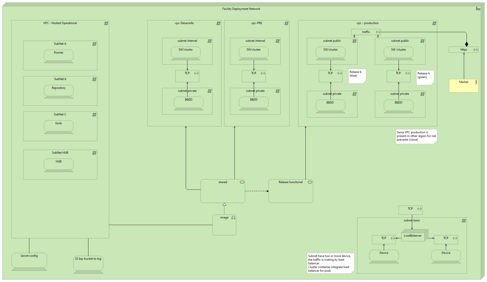
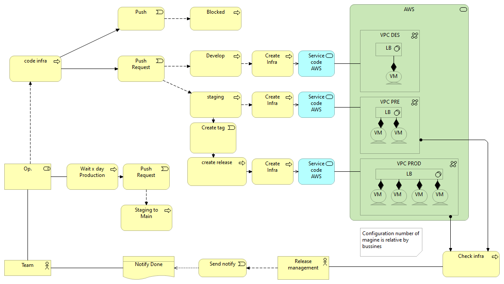
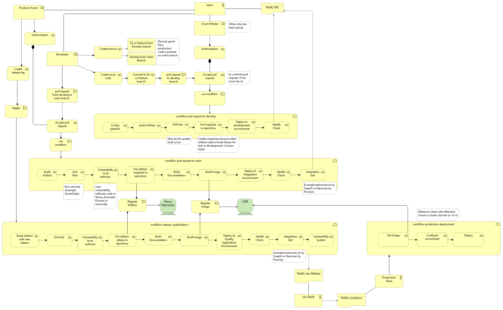

# GitHub workflow best pratices
# by Software Engineering

Index
----
- [Summary](#Summary)
- [Concepts](#Concepts)
- [Getting started](#Getting-started)
- [Testing](#Testing)
- [Contributing](#Contributing)
- [Maintainers](#Maintainers)

Summary
---
For the deployment of any software, it is necessary to design an infrastructure and a workflow that offers quality and speed of delivery at the same time. In this sense, the best practices aim to standardize the deployment and infrastructure model for use by the company. easily creating the infrastructure where the software will be hosted and deploy it on it.

Concepts
---
This repository contains all the workflow, modules and scripts standard necessary for the deployment of a product. 
It will be the basis for best practices and the basis for the deployment of the company.

In general, a company that develops software needs an environment for its own development as well as software, certification environments, as well as production environments. in this last, it is where more control is needed.
That is why the balancing is applied to a hidden environment to test the new functional release before presenting it to the market. in the next picture show architecture standard network.

 

In the philosophy of infrastructure by code, the github action itself is used to automatically create the necessary environments for both the agents and the environments where the software or cluster container will be hosted. next pricture represent workflow action to create environment

Finally, the developer uses a workflow that allows quality control and the deployment of his software in the environments or cluster, generating an image that will be kept in a registry and that allows maintaining a standard software and magine in all environments.
in next picture show workflow action

Getting started
---

Include any essential instructions for: Getting it, Installing It, Configuring It, Running it, see [DEVELOPERS.md](./DEVELOPERS.md)

Testing
---

Explaination on how to run tests

Contributing
---
Briefly explains how your team members or others can contribute to the project

For the contribution and workflow guide, see [CONTRIBUTING.md](./CONTRIBUTING.md).

Maintainers
---
Contact information of the team member whose is responsible for the project, see [CONTRIBUTING.md](./CONTRIBUTING.md).
