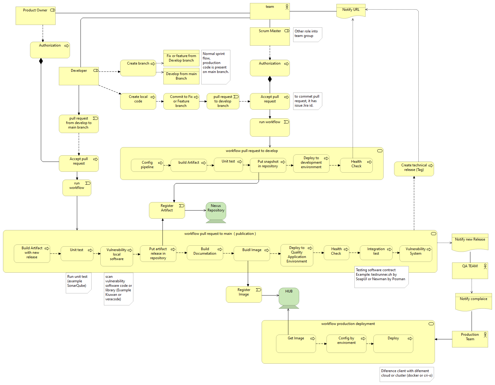
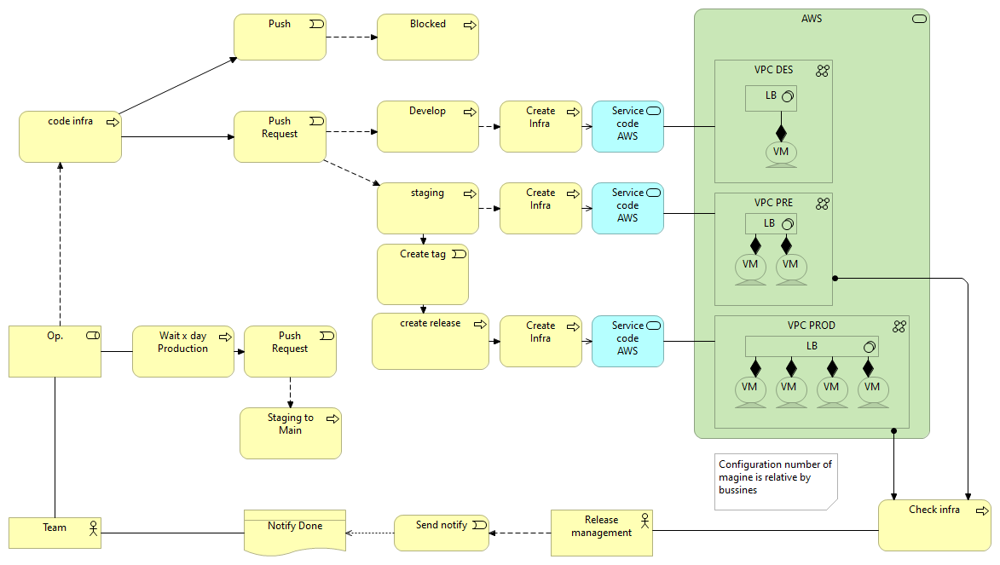

# Architecture Reference 
## Infrastructure Code & Software Deployment
## by Software Engineering

Index
----
- [Summary](#Summary)
- [Concepts](#Concepts)
- [Getting started](#Getting-started)
- [Contributing](#Contributing)
- [Maintainers](#Maintainers)


Summary
---
For the deployment of any software, it is necessary to design an infrastructure and a workflow that offers quality and speed of delivery at the same time. In this sense, the best practices aim to standardize the deployment and infrastructure model for use by the company. easily creating the infrastructure where the software will be hosted and deploy it on it.

Concepts
---
This repository contains all the workflow, modules and scripts standard necessary for the deployment of a product. 
It will be the basis for best practices and the basis for the deployment of the company.

In general, a company that develops software needs an environment for its own development as well as software, certification environments, as well as production environments. in this last, it is where more control is needed.
That is why the balancing is applied to a hidden environment to test the new functional release before presenting it to the market. in next picture show architecture standard network.

 

In the philosophy of infrastructure by code, the github action itself is used to automatically create the necessary environments for both the agents and the environments where the software or cluster container will be hosted. 
for this purpose terraform's modules is used that allows to define code blocks for the infrastructure, the infrastructure will be created the first time when deploying.

>**About the Terraform Language:** The main purpose of the Terraform language is declaring resources, which represent infrastructure objects. All other language features exist only to make the definition of resources more flexible and convenient.
A Terraform configuration is a complete document in the Terraform language that tells Terraform how to manage a given collection of infrastructure. A configuration can consist of multiple files and directories.more information to [terraform best practice](https://github.com/Iberia-Ent/software-engineering--best-practices--iac--terraform--documentation)

This repository have diferente terraform standars modules by create infraestructure by code. more information to see [DEVELOPERS.md](./DEVELOPERS.md)

Finally, the developer uses a workflow that allows quality control and the deployment of his software in the environments or cluster, generating an image that will be kept in a registry and that allows maintaining a standard software and magine in all environments.
in next picture show workflow action



Every workflow needs a server to be able to execute and perform all the necessary calculation operations. for this purpose the use of hosted runner is recommended. the hosted runner is posible configure and install tool and apply security access to cloud account. 

Hosted runner
---
You can host your own runners and customize the environment used to run jobs in your GitHub Actions workflows. see [About self-hosted runners](https://docs.github.com/en/enterprise-server@3.3/actions/hosting-your-own-runners/about-self-hosted-runners) 
A self-hosted runner is a system that you deploy and manage to execute jobs from GitHub Actions on your GitHub Enterprise Server instance.

For this purpose, a workflow has been designed that performs the creation of the runner itself.

Below is a workflow for creating a runner server hosted in the cloud itself and associated with the source code repositories. when the source code repository workflow runs, all processing will be done on top of these runner servers.



see [module terraform common infra]( https://github.com/Iberia-Ent/software-engineering--deployments-sdlc-common--infra)

## Configure runner with cloud config
The runner server can have a trusted connection configured for the different accounts of the new one. this allows not having secrets configured in the organization or repositories, but rather the runner itself makes the connection through profiles through the cloud client. 
Assuming that the servers themselves contain the installed [aws clients](https://docs.aws.amazon.com/cli/latest/userguide/getting-started-install.html), the runners and the workflow can be configured in different ways, for example:

- **Configure runner for environment:** For this type of configuration, one runner per environment is considered. each runner has access to the cloud account of the environment. this forces the workflow to have configured in each job the runner that corresponds to the environment where it must connect.
````
jobs:
  build:
    name: build
    runs-on: [self-hosted, dev]
````
- **Configure runner with profile connection:** In this configuration, the runner contains its own cloud access credentials under profiles. When executing the workflow, it uses the profile instead of the secret directly. this allows you to remove the github secrets. see [configure profile]( https://docs.aws.amazon.com/cli/latest/userguide/cli-configure-files.html)

>If the github secrets aren't configured to access the cloud client, the system considers that there is a pre-existing configuration and uses that configuration. this is valid for the first option as long as the runners are'll configured in the workflow. for the second option it'll be necessary to adapt the configuration scripts with each profile.

Getting started
---
This repository contains the core modules that are referenced in the workflow templates for each purpose.
the workflow templates such as infrastructure by code and software deployment based on the technology used, for example angular for the front or spring / quarkus for the backend.

**Get Started:**
- [continous integration with github flow](https://github.com/Iberia-Ent/software-engineering--getting-started--github--flow)
- [continous integration with git flow](https://github.com/Iberia-Ent/software-engineering--getting-started--git--flow)

Include any essential instructions for core: Getting it, Installing It, Configuring It, Running it, see [DEVELOPERS.md](./DEVELOPERS.md)

Contributing
---
Briefly explains how your team members or others can contribute to the project

For the contribution and workflow guide, see [CONTRIBUTING.md](./CONTRIBUTING.md).

Maintainers
---
Contact information of the team member whose is responsible for the project, see [CONTRIBUTING.md](./CONTRIBUTING.md).
